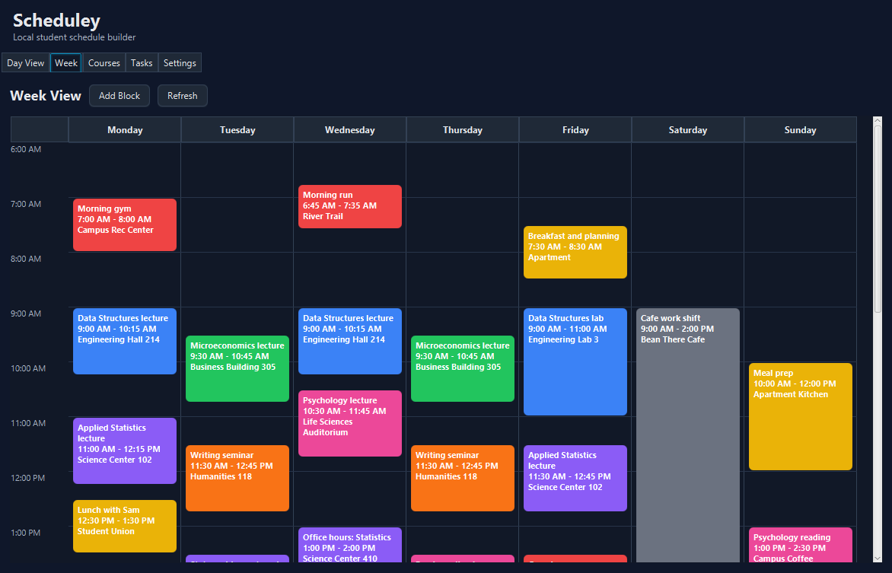
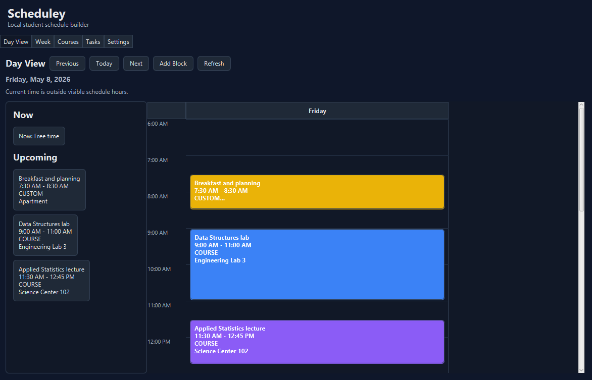
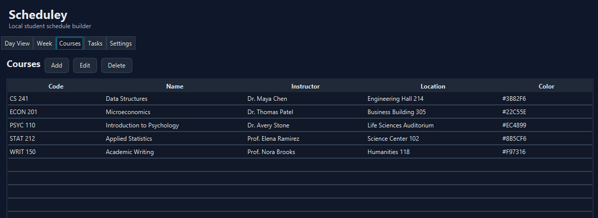
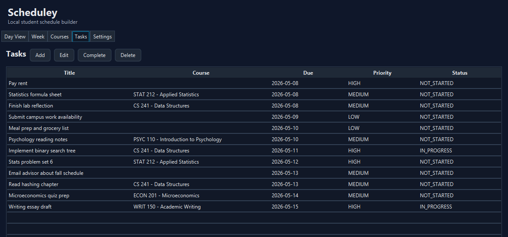
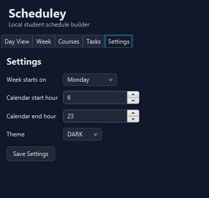

# Scheduley

Scheduley is a local-first JavaFX desktop app that helps students organize courses, work shifts, tasks, and study blocks in one weekly schedule.

## Overview

Scheduley is built as a practical desktop scheduling tool for students who want a simple, private way to plan their week. The app opens directly into a weekly calendar, stores data locally in SQLite, and keeps the core workflow focused on courses, tasks, and scheduled time blocks.

The project is intentionally scoped as an MVP: it demonstrates JavaFX UI development, SQLite-backed persistence, DAO-based data access, validation, and a layered desktop application structure without relying on cloud services.

## Why I Built It

Student schedules often mix classes, work shifts, study time, assignments, and personal obligations. I built Scheduley to practice designing a complete desktop application around that problem: modeling the data, persisting it locally, validating user input, and presenting it in views that make the week easier to understand.

## Current Features

- Weekly calendar with Monday-Sunday columns and vertical time positioning
- Day View for today's schedule, current activity, upcoming blocks, and a moving current-time bar
- Course CRUD with code, name, instructor, location, color, and notes
- Task CRUD with optional course link, due date, estimated minutes, priority, status, and notes
- Time block CRUD for `COURSE`, `WORK`, `STUDY`, `TASK`, and `CUSTOM` blocks
- Work shifts represented as `WORK` time blocks
- Preset color picker for course and time block colors
- Duplicate existing time blocks with Save as Copy
- Basic overlap conflict detection for blocks on the same day
- Persisted settings for week start day, calendar start hour, calendar end hour, and theme value
- Local SQLite persistence through `scheduley.db`

## Tech Stack

- Java 21
- JavaFX
- Maven
- SQLite
- JDBC
- JUnit 5

## Screenshots

### Week View



### Day View



### Courses



### Tasks



### Settings



## Architecture

Scheduley uses a layered structure to keep UI, application state, and persistence responsibilities separated.

Core packages:

- `com.scheduley.db`: SQLite connection and database migrations
- `com.scheduley.models`: Course, task, time block, and settings models
- `com.scheduley.dao`: DAO interfaces for persistence operations
- `com.scheduley.dao.sqlite`: SQLite DAO implementations
- `com.scheduley.viewmodel`: JavaFX-facing state loading and saving
- `com.scheduley.ui`: JavaFX views and dialogs
- `com.scheduley.util`: time formatting, parsing, and validation helpers

SQL is kept out of UI classes. JavaFX views call view models and DAOs for persistence, which keeps the app easier to test and extend.

## Database Design

Scheduley stores data in a local SQLite database. Migrations create the core tables and constraints when the app starts.

Main tables:

- `course`: course code, name, instructor, location, color, notes, and timestamps
- `task`: task title, optional course relationship, due date, estimate, priority, status, notes, and timestamps
- `time_block`: scheduled blocks for courses, tasks, work, study, and custom events
- `app_settings`: persisted user preferences for calendar display and theme

The schema uses foreign keys to keep related records consistent. Tasks can be linked to courses, and time blocks can reference courses or tasks. Time block constraints validate minute ranges and day-of-week values.

## How to Run

Requirements:

- JDK 21
- Maven

Run the app:

```powershell
mvn javafx:run
```

If Maven is not on your PATH, install Maven or run the project from an IDE that can import `pom.xml`.

## How to Test

Run the automated test suite:

```powershell
mvn test
```

The tests use isolated SQLite database files under `target/test-dbs/` and do not modify the local app database.

## Manual Acceptance Checks

1. Delete `scheduley.db`, then start the app. It should recreate the database and open to Week View.
2. Add, edit, restart, and delete a course.
3. Add a task, link it to a course, mark it complete, restart, and verify it persists.
4. Add `COURSE`, `WORK`, and `STUDY` blocks and verify they appear in Week View and Day View.
5. Add overlapping blocks on the same day and verify a conflict warning appears.
6. Change calendar start/end settings and verify the Week View and Day View update after saving.
7. Open Day View on today's date and verify the current-time bar and Now section update.

## Roadmap

Near-term improvements:

- Drag-and-drop calendar editing
- Recurring class meetings with generated weekly blocks
- Better visual treatment for overlapping blocks
- Import/export
- Short demo GIF

Out of scope for the current MVP:

- Login and user accounts
- Cloud sync
- AI scheduling
- Syllabus parsing
- Google Calendar integration
- Notifications/reminders
- Mobile or web support

## Resume Highlights

- Built a JavaFX desktop scheduling application with SQLite-backed local persistence.
- Implemented DAO-based data access and separated UI, business logic, and persistence responsibilities.
- Designed CRUD workflows for courses, tasks, and time blocks with validation and conflict detection.
- Created database migrations for courses, tasks, time blocks, settings, constraints, and foreign-key relationships.
